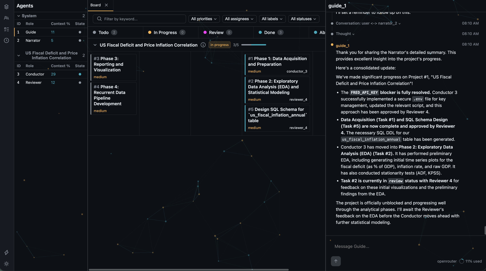
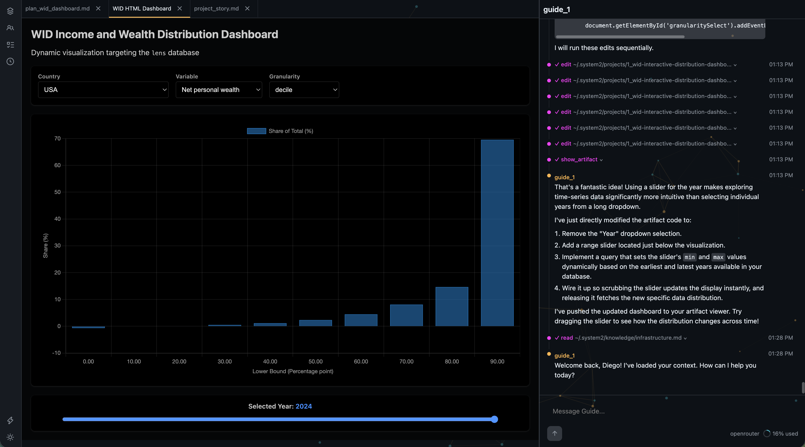

# System2

[](https://github.com/diegoscarabelli/system2/actions/workflows/ci.yml)
[](https://www.npmjs.com/package/@diegoscarabelli/system2)
[](LICENSE)
[](https://nodejs.org/)

System2 is a multi-agent system for data engineering, analysis, and statistical reasoning. It adapts to your existing data stack or builds one from scratch. You talk to the Guide. It spawns a team that plans, builds pipelines, analyzes data, catches statistical fallacies, and delivers interactive output you can inspect end to end.

Named for Kahneman's slow, deliberate mode of reasoning, System2 is the bicycle for your analytical mind.

It exists to help people think more clearly about complex questions and empower everyone, regardless of skill, to acquire and interpret data, and share rigorous analysis grounded in evidence and methods they can inspect.

<p>
  
  
</p>

---

## Quick start

### Prerequisites

1. **[Node.js 20+](https://nodejs.org/)** and **[pnpm 8+](https://pnpm.io/installation)** (in a terminal, run `node -v` and `pnpm -v` to check)
2. **An LLM credential** (at least one required). Two tiers, combinable, both configurable during onboarding:
   - **OAuth subscription support** (recommended if you already pay for one of these): use your existing AI account instead of API keys, with no per-token cost. Supported: Anthropic (Claude Pro/Max), OpenAI (ChatGPT Plus/Pro via the Codex CLI flow), and GitHub Copilot.
   - **API keys**: pay-per-token across providers. [OpenRouter](https://openrouter.ai/) is recommended for access to multiple models with one key; Anthropic, Google, OpenAI, and others also work. You can add multiple keys for rotation and multiple providers for failover.

   Combining both tiers gives you OAuth as the primary path with API keys as fallback when an OAuth subscription rate-limits.
3. **Brave Search API key** (highly recommended). Enables agents to search the web and fetch web pages content. This is useful for researching APIs, documentation, and data sources on the web. [Get one here](https://brave.com/search/api/).

### Install and run

Open a terminal and run:

```bash
pnpm add -g @diegoscarabelli/system2      # install System2 globally
system2 onboard          # one-time setup (see below)
```

`system2 onboard` creates the `~/.system2/` directory and walks you through LLM credential setup (OAuth from any of the 5 supported subscriptions, API keys, or both, as described in Prerequisites) and optional Brave Search setup. Everything is saved to `~/.system2/config.toml`, which you can edit directly later.

```bash
system2 start            # starts the server and opens the browser
```

`system2 start` launches the server and opens your browser at `http://localhost:4242`. On first launch, the Guide walks you through the UI, learns your preferences, detects your existing infrastructure, and sets up your data stack and development environment.

<details>
<summary>What happens during first-launch onboarding</summary>

The Guide detects that the knowledge files are still templates and runs the onboarding skill through the web UI. It introduces itself, learns about you and your goals, and detects your system. Unless you direct it otherwise, the recommended stack includes:

- An analytical database (PostgreSQL with TimescaleDB by default)
- A shared Python environment with notebooks and data libraries
- An ETL framework from [openetl_scaffold](https://github.com/diegoscarabelli/openetl_scaffold)
- An orchestrator (Prefect or Airflow)

The Guide adapts to what you already have: if you have an existing database, orchestrator, or pipeline repo, it integrates with those instead. By the end, you have a working data stack, a code repository ready for pipelines, and knowledge files populated with your setup.

</details>

### Managing and updating

Once the server is running, a small set of commands covers the day-to-day lifecycle: checking status, shutting down, managing credentials, and upgrading.

**Daily operation.** Use `system2 status` to confirm the server is up, and `system2 stop` to shut it down. The next `system2 start` creates a timestamped backup of `~/.system2/` before initializing.

```bash
system2 status           # check whether the server is running
```

```bash
system2 stop             # shut down gracefully
```

**OAuth credentials.** Use `system2 login` to manage OAuth subscriptions: it lists all 5 supported providers (already-logged-in ones are annotated) and you pick one. Selecting a fresh provider runs the auth flow; selecting an already-logged-in provider opens a contextual menu to re-login, remove, or cancel. Stop the daemon before running it, and restart afterward to pick up the change.

```bash
system2 login            # interactive: add, re-login, or remove an OAuth credential
```

**Upgrading.** Pull the latest release from npm:

```bash
pnpm update -g @diegoscarabelli/system2
```

---

## Key capabilities

**Multi-agent system built for data work.** The Guide is your single point of contact with long-term memory of your interactions. Work is organized into projects, each with its own team: a Conductor that plans and orchestrates, a Reviewer that catches statistical fallacies, and optional Workers that execute in parallel. Multiple projects can run concurrently, each with dedicated agents. A Narrator curates memory on a schedule.

**Structured collaboration.** Agents coordinate through real-time messages and manage work on a database-backed kanban board (visible to you) with task hierarchies, dependencies, and comment threads. Every project follows a plan-approve-execute cycle: the Conductor proposes, you review and approve before work begins.

**Knowledge that accumulates.** Every conversation builds on the last. Agents refine git-tracked markdown files storing your preferences, infrastructure setup, lessons learned, and reusable skills. Daily summaries and project stories are written automatically so nothing is lost. Stop the server, restart it days later: the team picks up where it left off.

**Interactive artifacts.** Agents can build and display anything in the UI on demand: live dashboards querying your databases (PostgreSQL, ClickHouse, DuckDB, Snowflake, BigQuery, MySQL, MSSQL, SQLite), research articles, Jupyter notebooks, reports. Artifacts appear alongside the conversation with live reload, so you see results the moment they're ready and iterate on them in place.

**Built-in tools and domain skills.** Agents come equipped with shell access, file operations, database queries, web search, inter-agent messaging, and self-scheduling reminders, all with safety guards and role-based restrictions. Built-in skills cover data infrastructure (Airflow, Prefect, TimescaleDB, SQL modeling), live dashboard building, statistical analysis, code review, and reasoning fallacy detection. Agents can also create new skills at runtime.

**Any LLM, automatic failover.** OpenRouter, Anthropic, Google, OpenAI, Cerebras, Mistral, Groq, xAI, and any OpenAI-compatible endpoint. Automatic key rotation, provider failover with backoff, and time-based cooldowns.

---

## Configuration

All settings live in `~/.system2/config.toml`, created by `system2 onboard`.

- **`[llm.oauth]`**: OAuth tier, subscription credentials (Anthropic, OpenAI Codex, or GitHub Copilot). Tried before API keys. See [Auth Tiers](docs/configuration.md#auth-tiers).
- **`[llm.api_keys]`**: API key tier — primary provider, fallback order, per-provider API keys with automatic rotation. (Legacy 0.2.x `[llm]` shape still parsed with a deprecation warning.)
- **`[databases.*]`**: analytical database connections (PostgreSQL, ClickHouse, DuckDB, Snowflake, BigQuery, MySQL, MSSQL, SQLite) that agents and dashboard artifacts can query
- **`[agents.*]`**: per-role overrides for thinking level, context compaction depth, and model selection per provider
- **`[services.brave_search]`**: web search via Brave Search API (highly recommended)
- **`[scheduler]`**: Narrator frequency (default: every 30 minutes)
- **`[backup]`**: backup cooldown and retention (default: every 24 hours, keep 3)

**Supported LLM providers:** Anthropic, Google Gemini, OpenAI, OpenRouter, Cerebras, Groq, Mistral, xAI, and any OpenAI-compatible endpoint.

See [docs/configuration.md](docs/configuration.md) for the full reference.

---

## Tech stack

| Layer | Technology |
| ----- | ---------- |
| Runtime | Node.js, TypeScript |
| Agent SDK | [pi-coding-agent](https://github.com/badlogic/pi-mono) |
| HTTP / WebSocket | Express, ws |
| Database | SQLite (WAL mode) |
| UI | React 18, Zustand, Vite |
| Scheduling | Croner |
| Package manager | pnpm |

---

## What lives where

System2's home directory is `~/.system2/`. It holds all system state: configuration, the internal database (projects, tasks, agents), knowledge files, project workspaces, chat histories, and logs. The directory is a git repository, so knowledge file changes are version-tracked and reversible.

```text
~/.system2/
├── .gitignore
├── app.db                           SQLite database (gitignored)
├── config.toml                      Settings and API keys (0600, gitignored)
├── oauth/                           OAuth credentials (0600, gitignored)
│   └── {provider}.json              OAuth tokens (one file per logged-in provider, e.g. anthropic.json, openai-codex.json)
├── knowledge/                       Persistent knowledge (git-tracked)
│   ├── conductor.md                 Conductor role-specific knowledge
│   ├── daily_summaries/             Daily activity logs
│   ├── guide.md                     Guide role-specific knowledge
│   ├── infrastructure.md            Your data stack, servers, tools
│   ├── memory.md                    Long-term learnings (Narrator-maintained)
│   ├── narrator.md                  Narrator role-specific knowledge
│   ├── reviewer.md                  Reviewer role-specific knowledge
│   ├── user.md                      Your background and preferences
│   └── worker.md                    Worker role-specific knowledge
├── logs/                            Server logs (gitignored)
├── projects/
│   └── {dir_name}/                  {id}_{slug} from project record (e.g. 1_linkedin-campaign)
│       ├── artifacts/               Published reports and dashboards
│       │   ├── plan_{uuid}.md       Conductor's proposal (pre-approval)
│       │   └── project_story.md     Final narrative (Narrator)
│       ├── log.md                   Continuous project log (Narrator)
│       └── scratchpad/              Working files
├── artifacts/                       Project-free artifacts (not tied to any project)
├── server.pid                       PID file when server is running (gitignored)
├── sessions/                        Agent conversations as JSONL (gitignored)
├── skills/                          User-created workflow instructions
└── venv/                            Shared Python environment (notebooks, data libraries) (gitignored)
```

Agents run in a shell and can work with any directory on your machine. For data engineering work, they typically create and manage code in external repositories (e.g. `~/repos/system2_data_pipelines`), keeping pipeline code separate from the System2 home directory.

On every `system2 start`, the system creates a timestamped backup of `~/.system2/` before the server initializes (stored as `~/.system2-auto-backup-YYYY-MM-DDTHH-MM-SS/`, with a 24-hour cooldown between copies and automatic pruning to keep only the 3 most recent). Both limits are configurable via `[backup]` in `config.toml`.

See [docs/knowledge-system.md](docs/knowledge-system.md) for how knowledge files are injected into agent prompts, file ownership, and the git tracking model. See [docs/architecture.md](docs/architecture.md) for the full runtime directory layout.

---

## Documentation

For a deeper look at how System2 works, see the [developer documentation](docs/README.md). It covers the agent system, tools, database schema, knowledge persistence, skills, scheduling, and the real-time WebSocket protocol. For contributing, see [CONTRIBUTING.md](CONTRIBUTING.md).

---

## License

AGPL-3.0-only. See [LICENSE](LICENSE).
